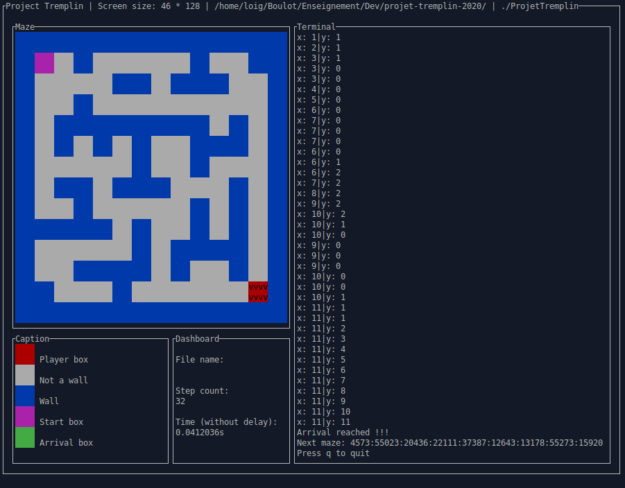

# Projet tremplin 2020

Projet de rentrée pour les étudiants en première année de DUT informatique à l'IUT de Nantes (2020-2021).

## Informations générales

Ce projet est basé sur le travail de Albert Guihard, Alexis Guillotin et Simon Perrin, réalisé durant les projets tutorés de DUT2 en 2019-2020. Leur code a été par la suite légèrement modifié par Loïg Jezequel.

## Contenu du dépôt

* Makefile, pour construire l'exécutable
* main.c, le code principal de l'exécutable
* lib/, la bibliothèque de gestion des labyrinthes
* labs/, quelques exemples de labyrinthes
* enonce/, l'énoncé du projet
* fodaly/, l'explication du format de description des labyrinthes
* generation/, les outils de génération de labyrinthes
* scripts/, des scripts utiles pour générer la version étudiant du projet
* server/, le serveur pour le concours

## Quelques notes sur le Makefile

* make produit un executable avec les fichiers du dépôt
* make project construit une archive de ce qu'il faut donner aux étudiants
